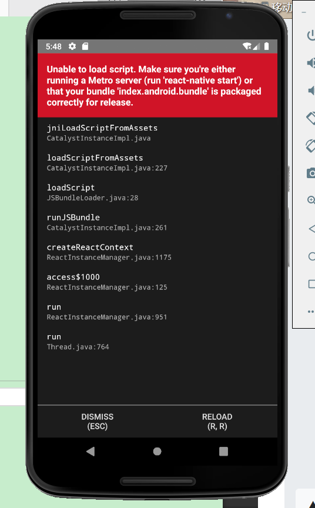
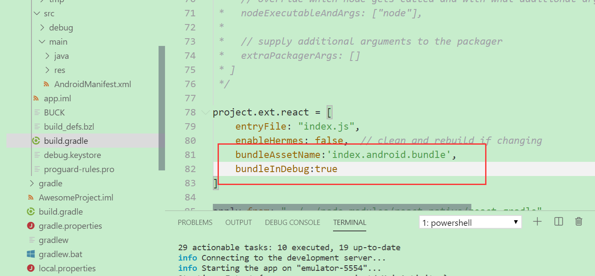

# 环境配置
按照官网上的来就行。
要注意的是下载andriod 安装包时需要翻墙，安装过程中要保证良好的网络环境，百分之九十九的错误都是由于网络不好导致的，可以使用翻墙软件来进行安装操作，并且要注意磁盘空间充足。


# 运行```react-native run-android```时红屏报错


## 解决方法
由红屏错误信息得知缺少**index.android.bundle**文件。做如下修改：
在src/app/build.gradle中如图所示位置加入如下代码:
```js
bundleAssetName:'index.android.bundle',
bundleInDebug:true
```



# 打开app.js 报错 **'types' can only be used in a .ts file.**

# 选中模拟运行中的android 机器，按ctrl + m键盘会调出移动端开发者菜单
仿佛react native 中的任何东西都有一种约束，比如不能有连续两个空格
# 自动刷新-热加载
暂时没有解决(貌似自带自动刷新功能，只要一摁alt + tab就刷新了
其实是版本更新为快速刷新了，按ctrl + s即可刷新
# 20191127
今天改变react native 的学习路线。以项目为驱动，兴趣为出发点，树叶有专攻，一个人不可能成为全才，所以重要的是让我们擅长的部分闪闪发亮。

初步计划做一个项目，目的有以下几点：
- 学习react native,扩充技术栈。丰富实战经验
- 做其他相关项目，积攒工程经验
- 学习框架底层原理和基础知识
- 做自己的产品，给自己一个交代
react native 做原生基础组件及调用等基本操作，webview镶嵌web端。所以一方面学习react native基础组件部分等，另一方面就做web项目，丰富工程经验

## 初定react native学习路线(按需学习)
- 基础组件(导航、视图、滚动条、进度条等)
- 相关库(路由、redux等)
- webview 以及webview与H5通信
- 网络相关

# react native 导航模块
react native 今后主推 **react-navigation**，所以，这里我也只学习** react-navigation**了
```npm install --save react-navigation```
# 当端口找不到时，ctrl + m ，找到设置端口的地方，本机ip(ipv4 + :8081)
# 当安卓环境出现问题时，android studio 重新编译一遍，不要着急，有时可能由于网络原因没有更新及时导致的(不要随便点击android studio中的更新建议，可能会造成未知错误)
# 当命令行界面没有出现启动端口的相关提示时，不要着急，看是否开启了node窗口，在那里面开启了服务

# 我他妈时整明白了，当报错为**make sure ……envrioment时**，首先检查端口是否一致，其次，虚拟机不能先运行，但android studio 必须得先编译

# 每次每次下载安装了新的包，就需要重新编译，重新运行。运行不成功的时候，就多试几次，关上再开.安装包的时候先把服务停了，安装完成再重新编译，重新运行(尝试多次不成功时，就将上次修改的内容注释掉再运行)

# 有时候错误时由于代码书写不规范导致的，比如eslink代码规范，有时候多了了一个分号就会导致编译错误，又比如onpress里面必须写函数，不写函数也会导致编译错误